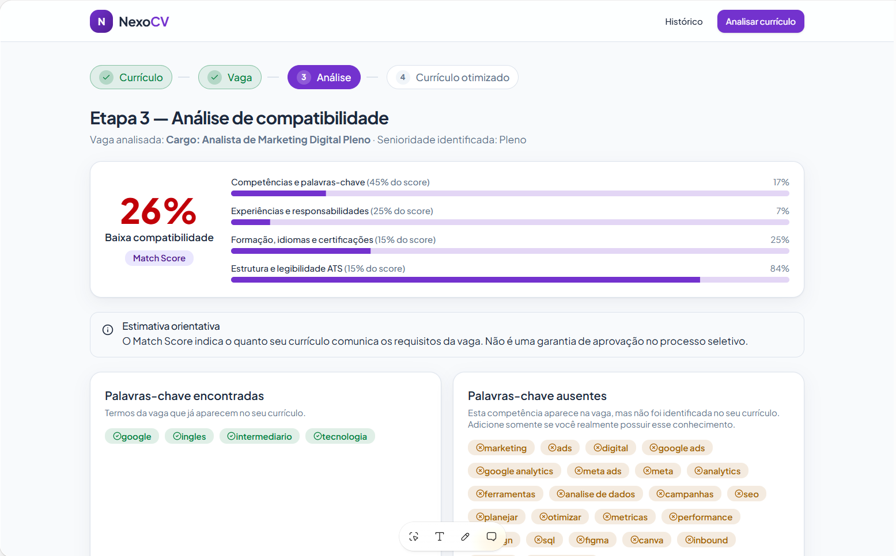
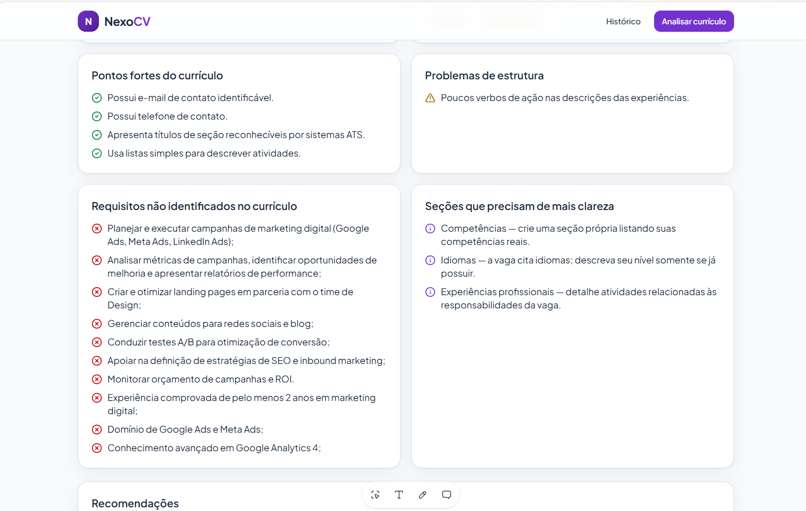
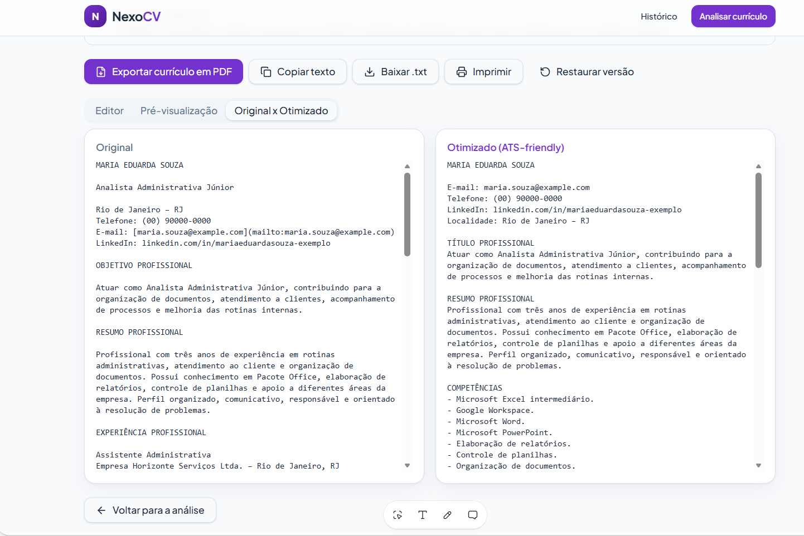
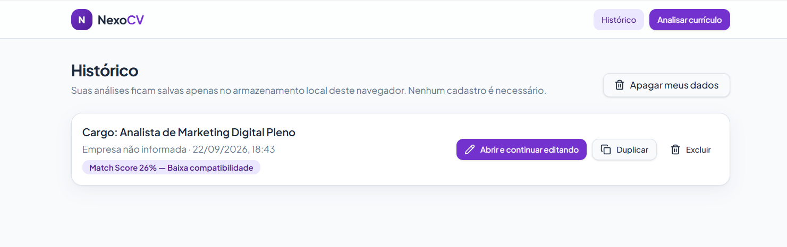

# NexoCV — Gerador de Currículos ATS-Friendly

> **Conecte seu currículo à vaga certa.**

O **NexoCV** é uma aplicação web criada no desafio **Criando um Gerador de Currículos ATS-Friendly com Lovable**, da DIO. A solução compara um currículo com a descrição de uma vaga, calcula a compatibilidade, identifica palavras-chave e produz uma versão mais clara e adequada à leitura por sistemas ATS.

**Aplicação publicada:** [nexo-curriculo-conector.lovable.app](https://nexo-curriculo-conector.lovable.app)

## Problema que a aplicação resolve

Um currículo pode conter experiências relevantes e ainda ser descartado antes da leitura humana quando sua estrutura ou seu vocabulário dificultam a interpretação pelo ATS (*Applicant Tracking System*). O NexoCV ajuda o candidato a entender essa diferença e melhorar a apresentação das informações que realmente possui.

A regra ética central é:

> O NexoCV pode reorganizar e melhorar a redação, mas nunca deve inventar experiências, competências, formações, certificações, idiomas ou resultados.

## Funcionalidades

- Inserção do currículo por texto ou upload de PDF, DOCX e TXT;
- leitura dos arquivos diretamente no navegador, com limite de 5 MB;
- campo para a descrição da vaga e dados opcionais de cargo, empresa e link;
- Match Score de 0 a 100, acompanhado de classificação;
- palavras-chave encontradas e ausentes;
- identificação de requisitos não localizados no currículo;
- pontos fortes, problemas de estrutura e recomendações explicadas;
- currículo otimizado em uma única coluna, sem elementos incompatíveis com ATS;
- editor com comparação **Original x Otimizado** e restauração da versão;
- exportação em PDF A4 com texto selecionável;
- cópia do texto, download em `.txt` e impressão;
- histórico local com abertura, duplicação, exclusão e limpeza dos dados;
- interface responsiva, acessível e construída com componentes shadcn/ui.

## Como a análise funciona

1. O currículo e a vaga são normalizados e sanitizados.
2. A aplicação identifica cargo, senioridade, responsabilidades, requisitos, tecnologias, competências comportamentais, formação, idiomas e certificações.
3. Termos genéricos de anúncios são filtrados para não aparecerem como falsas competências.
4. As palavras-chave são comparadas com o conteúdo real do currículo.
5. O resultado é calculado com quatro componentes:

| Componente | Peso | O que é avaliado |
| --- | ---: | --- |
| Competências e palavras-chave | 45% | Presença dos termos relevantes, prioridade dos obrigatórios e frequência na vaga |
| Experiências e responsabilidades | 25% | Correspondência entre as atividades da vaga e as experiências descritas |
| Formação, idiomas e certificações | 15% | Requisitos acadêmicos e complementares encontrados |
| Estrutura e legibilidade ATS | 15% | Contatos, seções, listas, datas, verbos de ação e ausência de tabelas/colunas |

6. A versão otimizada reorganiza apenas informações presentes no currículo original.
7. O usuário revisa o texto e pode exportá-lo. O PDF é gerado em A4, uma coluna e com texto real selecionável.

O score é uma estimativa orientativa e não representa garantia de aprovação em um processo seletivo.

## Evidências de funcionamento

### Match Score e palavras-chave

Teste realizado com um currículo fictício de perfil administrativo comparado a uma vaga de Analista de Marketing Digital Pleno. O resultado de **26%** demonstra que a ferramenta não força uma compatibilidade inexistente.



### Diagnóstico detalhado

A análise apresenta pontos fortes, problemas estruturais, requisitos não identificados e seções que precisam de mais clareza.



### Currículo original e versão otimizada

O editor permite comparar as duas versões antes da exportação. A versão ATS-friendly preservou o perfil administrativo original e não inventou experiência em marketing.



### Histórico local

As análises ficam armazenadas somente no navegador e podem ser reabertas, duplicadas ou excluídas.



## Ajustes realizados depois da primeira geração

A primeira versão definiu a identidade visual, a página inicial e o fluxo em quatro etapas. Durante o refinamento, foram realizados os seguintes ajustes:

- correção de erros de tipagem e compilação que impediam a publicação;
- validação do fluxo completo no navegador;
- leitura real de arquivos PDF, DOCX e TXT no próprio dispositivo;
- filtragem de palavras genéricas, como “apoiar”, “analisar” e “pleno”, que apareciam incorretamente como competências;
- implementação da fórmula ponderada do Match Score;
- criação do editor e da comparação Original x Otimizado;
- exportação do PDF com texto selecionável, em vez de uma imagem;
- inclusão do histórico no `localStorage` e da opção “Apagar meus dados”;
- testes de upload, análise, geração do currículo, histórico e exportação.

Esses refinamentos foram feitos para transformar a primeira interface em um MVP funcional e tornar o resultado mais transparente e seguro para o candidato.

## Teste executado

O cenário principal utilizou a candidata fictícia **Maria Eduarda Souza**, com experiência administrativa, e uma vaga de marketing digital. A baixa compatibilidade encontrada foi coerente com os dados fornecidos. Também foram conferidos:

- extração de texto de PDF e DOCX;
- classificação e composição do score;
- recomendações sem criação de competências;
- geração do currículo em coluna única;
- PDF A4 com conteúdo selecionável;
- persistência e gerenciamento do histórico.

## Privacidade e segurança

- O processamento dos documentos acontece no navegador.
- Os dados das análises são gravados no `localStorage` do próprio dispositivo.
- Não é necessário criar conta.
- O usuário pode apagar todos os dados salvos.
- Não há chave de API exposta ou serviço externo recebendo o currículo nesta versão.
- Textos e arquivos passam por validação antes do processamento.

## Tecnologias utilizadas

- React 19;
- TypeScript;
- TanStack Start e TanStack Router;
- Vite;
- Tailwind CSS 4;
- shadcn/ui e Radix UI;
- jsPDF para exportação do PDF;
- PDF.js para leitura de PDF;
- Mammoth para leitura de DOCX;
- `localStorage` para histórico e sessão;
- Lovable para planejamento, geração, refinamento e publicação.

## Executando localmente

É necessário ter Node.js e npm instalados.

```bash
git clone https://github.com/jessicafmaximiano/nexo-curriculo-conector.git
cd nexo-curriculo-conector
npm install
npm run dev
```

Para gerar a versão de produção:

```bash
npm run build
```

## Mega prompt

O prompt foi estruturado como um PRD em Markdown e descreveu o produto, o fluxo, a regra ética, o cálculo do score, a exportação, a identidade visual e os critérios de aceitação.

<details>
<summary><strong>Abrir o mega prompt completo</strong></summary>

### Prompt final utilizado no Lovable

#### 1. Visão geral

Crie uma aplicação web responsiva chamada **NexoCV**.

Slogan:

> Conecte seu currículo à vaga certa.

O NexoCV deve ajudar candidatos a comparar seu currículo com a descrição de uma vaga, compreender seu nível de compatibilidade e gerar uma versão otimizada para sistemas ATS.

A aplicação deve ser funcional, profissional, acessível e simples de utilizar.

Toda a interface deve estar em português brasileiro.

#### 2. Problema

Muitos candidatos possuem as competências necessárias para uma vaga, mas seus currículos são eliminados antes da análise humana porque:

- não apresentam as palavras-chave esperadas;

- utilizam estruturas difíceis para sistemas ATS;

- possuem descrições pouco objetivas;

- não estão adaptados para a vaga;

- utilizam colunas, gráficos, ícones ou elementos visuais incompatíveis com ATS.

O NexoCV deve ajudar o usuário a apresentar melhor suas experiências reais, sem inventar informações.

#### 3. Público-alvo

- Pessoas procurando emprego;

- Profissionais em transição de carreira;

- Estudantes e candidatos a estágio;

- Pessoas que enviam currículos por plataformas como Gupy, LinkedIn e sites corporativos;

- Profissionais que não sabem adaptar o currículo para cada vaga.

#### 4. Regra ética obrigatória

A aplicação nunca deve inventar:

- experiências profissionais;

- empresas;

- cargos;

- competências;

- formações;

- certificações;

- idiomas;

- resultados ou números;

- períodos de trabalho.

A aplicação pode melhorar a redação, reorganizar informações e utilizar palavras-chave da vaga somente quando elas forem compatíveis com informações existentes no currículo.

Quando uma palavra-chave importante estiver ausente, mostre:

> Esta competência aparece na vaga, mas não foi identificada no seu currículo. Adicione somente se você realmente possuir esse conhecimento.

#### 5. Fluxo principal

O fluxo deve ser dividido em quatro etapas:

1. Inserir currículo;

2. Inserir descrição da vaga;

3. Analisar compatibilidade;

4. Revisar e exportar o currículo otimizado.

Exiba um indicador de progresso no topo:

**Currículo → Vaga → Análise → Currículo otimizado**

#### 6. Tela inicial

Crie uma landing page objetiva contendo:

- Logotipo textual NexoCV;

- Slogan;

- Explicação curta da proposta;

- Botão “Analisar meu currículo”;

- Bloco explicando as três etapas:

  1. Adicione seu currículo;

  2. Cole a descrição da vaga;

  3. Receba a análise e a versão otimizada;

- Aviso de privacidade;

- Aviso de que a ferramenta não garante aprovação no processo seletivo.

Texto principal sugerido:

> Descubra como seu currículo conversa com a vaga antes de enviá-lo.

Texto secundário:

> Compare competências, encontre palavras-chave importantes e gere uma versão mais clara e compatível com sistemas ATS.

#### 7. Entrada do currículo

Permita duas formas de inserir o currículo:

### Opção principal

Uma área de texto grande para colar o conteúdo completo do currículo.

### Opção adicional

Upload de arquivos:

- PDF;

- DOCX;

- TXT.

Quando o upload não puder ser processado corretamente, permita que o usuário cole o texto manualmente.

Exiba:

- contador de caracteres;

- botão para limpar;

- validação de conteúdo mínimo;

- mensagem de erro clara;

- confirmação quando o conteúdo for reconhecido.

Não envie documentos para serviços externos sem informar o usuário.

#### 8. Entrada da vaga

Crie um campo grande para colar a descrição completa da vaga.

Inclua campos opcionais:

- Cargo;

- Empresa;

- Link da vaga.

O sistema deve tentar identificar automaticamente:

- cargo;

- senioridade;

- responsabilidades;

- requisitos obrigatórios;

- requisitos desejáveis;

- tecnologias;

- competências comportamentais;

- formação;

- idiomas;

- certificações;

- palavras-chave importantes.

#### 9. Análise de compatibilidade

Ao clicar em **“Analisar compatibilidade”**, apresente um estado de carregamento com mensagens como:

- “Lendo seu currículo...”;

- “Identificando requisitos da vaga...”;

- “Comparando competências...”;

- “Preparando suas recomendações...”.

Depois, apresente um relatório com:

### Match Score

Mostre um percentual entre 0 e 100 e uma classificação:

- 0 a 39: Baixa compatibilidade;

- 40 a 59: Compatibilidade parcial;

- 60 a 79: Boa compatibilidade;

- 80 a 100: Alta compatibilidade.

Informe que o resultado é uma estimativa orientativa, e não uma garantia de aprovação.

### Composição sugerida do score

- 45%: competências e palavras-chave;

- 25%: experiências e responsabilidades;

- 15%: formação, idiomas e certificações;

- 15%: estrutura e legibilidade ATS.

### Resultados da análise

Apresente:

- Palavras-chave encontradas;

- Palavras-chave ausentes;

- Competências compatíveis;

- Requisitos não identificados;

- Pontos fortes do currículo;

- Problemas de estrutura;

- Sugestões de melhoria;

- Seções que precisam de mais clareza.

Use cores acompanhadas de textos e ícones, nunca somente cores.

#### 10. Recomendações

As recomendações devem ser específicas e acionáveis.

Exemplos:

- “Inclua um resumo profissional direcionado ao cargo.”

- “Utilize o nome completo da tecnologia em vez de apenas sua sigla.”

- “Apresente suas atividades com verbos de ação.”

- “A vaga menciona atendimento ao cliente, mas essa expressão não aparece no currículo.”

- “Evite tabelas e múltiplas colunas na versão enviada ao ATS.”

Não apresente recomendações genéricas sem explicar o motivo.

#### 11. Currículo ATS-friendly

Crie uma versão otimizada utilizando somente informações presentes no currículo original.

Organize em uma coluna, nesta ordem:

1. Nome;

2. Informações de contato;

3. Objetivo ou título profissional;

4. Resumo profissional;

5. Competências;

6. Experiências profissionais;

7. Formação acadêmica;

8. Cursos e certificações;

9. Idiomas;

10. Projetos, quando existirem.

O currículo deve:

- usar títulos claros;

- evitar tabelas;

- evitar ícones;

- evitar gráficos;

- evitar barras de habilidade;

- evitar fotos;

- utilizar listas simples;

- possuir boa hierarquia;

- apresentar datas de forma consistente;

- ter texto selecionável;

- ser compreensível mesmo sem elementos visuais.

#### 12. Editor

Crie um editor para o usuário revisar o currículo antes da exportação.

Disponibilize:

- edição manual de todas as seções;

- comparação “Original x Otimizado”;

- botão “Restaurar versão”;

- botão “Copiar texto”;

- salvamento automático no navegador;

- aviso para o usuário revisar todas as informações.

As alterações feitas pelo usuário devem ser preservadas durante a sessão.

#### 13. Exportação

Adicione um botão funcional:

> Exportar currículo em PDF

O PDF deve:

- possuir texto real e selecionável;

- utilizar apenas uma coluna;

- manter títulos bem definidos;

- evitar imagens e gráficos;

- ter margens profissionais;

- funcionar em A4;

- utilizar fonte legível;

- corresponder ao conteúdo revisado no editor.

Não gere o currículo como uma imagem.

Nome sugerido:

`Curriculo_Nome_Cargo.pdf`

Também permita:

- copiar o currículo como texto;

- imprimir;

- baixar uma versão `.txt`.

#### 14. Histórico local

Sem exigir cadastro, salve no navegador:

- data da análise;

- cargo;

- empresa;

- Match Score;

- currículo original;

- currículo otimizado.

Crie uma página “Histórico” com opções para:

- abrir;

- continuar editando;

- duplicar;

- excluir.

Inclua um botão “Apagar meus dados” e explique que os dados ficam armazenados no navegador.

#### 15. Identidade visual

Use um design profissional, acolhedor e moderno.

### Paleta

- Roxo principal: `#6D28D9`;

- Roxo escuro: `#4C1D95`;

- Lilás claro: `#EDE9FE`;

- Fundo: `#F8FAFC`;

- Branco: `#FFFFFF`;

- Texto principal: `#1E293B`;

- Texto secundário: `#64748B`;

- Sucesso: `#15803D`;

- Alerta: `#B45309`;

- Erro: `#B91C1C`.

Use componentes do **shadcn/ui**.

Utilize tipografia limpa, espaçamento consistente, cantos moderadamente arredondados e sombras discretas.

#### 16. Acessibilidade e responsividade

A aplicação deve:

- funcionar em desktop, tablet e celular;

- possuir contraste adequado;

- permitir navegação por teclado;

- apresentar labels nos campos;

- mostrar foco visível;

- possuir mensagens de erro compreensíveis;

- utilizar HTML semântico;

- não depender apenas de cor;

- respeitar redução de movimento.

#### 17. Estados da aplicação

Implemente:

- tela vazia;

- carregamento;

- erro;

- sucesso;

- dados insuficientes;

- arquivo incompatível;

- análise concluída;

- nenhuma análise no histórico.

Não deixe botões sem funcionamento.

#### 18. Segurança e privacidade

- Não exponha chaves de API no frontend;

- Não registre dados pessoais no console;

- Sanitize os textos inseridos;

- Valide o tamanho e o tipo dos arquivos;

- Não envie currículos a serviços externos sem necessidade;

- Mostre um aviso de privacidade;

- Utilize armazenamento local nesta primeira versão.

#### 19. Critérios de aceitação

O MVP somente estará concluído quando for possível:

1. Inserir um currículo;

2. Inserir uma descrição de vaga;

3. Executar a comparação;

4. Visualizar o Match Score;

5. Consultar palavras-chave presentes e ausentes;

6. Receber recomendações;

7. Gerar uma versão ATS-friendly;

8. Editar o currículo gerado;

9. Copiar o texto;

10. Exportar um PDF com texto selecionável;

11. Acessar uma análise salva;

12. Utilizar a aplicação em celular e desktop.

#### 20. Prioridade de implementação

Implemente primeiro o fluxo principal totalmente funcional:

**Currículo → Vaga → Análise → Otimização → Exportação**

Somente depois adicione histórico, animações e refinamentos visuais.

Não crie apenas uma demonstração visual. Os botões, formulários, análise, editor, armazenamento e exportação devem funcionar de verdade.

</details>

## Aprendizados

Este projeto mostrou que o Vibe Coding não termina na primeira geração. Um prompt detalhado ajuda a estabelecer o escopo, mas a qualidade do produto depende da validação do fluxo, da observação dos resultados e de refinamentos específicos.

Também aprendi a transformar uma regra ética em comportamento verificável: em vez de preencher lacunas artificialmente, o NexoCV sinaliza o que não foi encontrado e orienta o usuário a adicionar uma informação somente quando ela for verdadeira. A etapa de testes foi essencial para corrigir termos genéricos, validar a leitura dos arquivos e confirmar que o PDF continuava legível por sistemas ATS.

## Possíveis evoluções

- exportação também em `.docx`;
- autenticação opcional e sincronização entre dispositivos;
- banco de dados para histórico em nuvem;
- dashboard de evolução do Match Score;
- análises especializadas por área profissional;
- melhorias de SEO e GEO;
- testes automatizados de regressão.

## Autoria

Desenvolvido por **Jéssica Maximiano** durante o bootcamp da DIO, com apoio do Lovable no processo de Vibe Coding.

- [Aplicação](https://nexo-curriculo-conector.lovable.app)
- [Repositório](https://github.com/jessicafmaximiano/nexo-curriculo-conector)
- [Perfil no GitHub](https://github.com/jessicafmaximiano)
